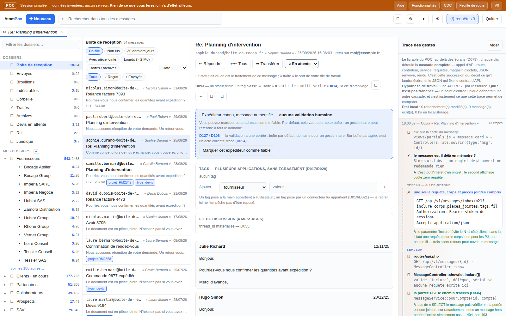

# AtomBox — le dépôt

**Un moteur de stockage d'emails, son API, et le webmail qui les consomme.**
Démo (session simulée, données inventées) : <https://atombox.dev.iprospective.fr/> — se connecter
avec `poc` / `poc`.



À droite, la **trace des gestes** : pour chaque clic, la cascade complète — appel d'API, route,
contrôleur, service, requêtes, magasin d'octets, JSON renvoyé. C'est elle le livrable du POC,
plus que les écrans : elle décrit ce qu'il faudra écrire, et fixe le contrat d'API.

Un seul dépôt pour le produit (**D156**) :

| Dossier | Contenu |
|---|---|
| `webmail/` | l'interface — un seul `index.html` (D157) ; `src/noyau`, `src/modules/<nom>/` (vue, contrôleur, service, style SCSS), `src/poc` ; `css/app.css` compilé par `npm run css` — **D141**, **D160** |
| `serveur/` | le serveur, en Python (**D154**) : schéma, magasin d'octets, démon d'ingestion, moteur de filtres, API, page d'état — découpé par fonctionnalité de V0 |
| `outils/` | ce qui sert aux deux : `gen-dict.py` (le chapitre 16 depuis `dict/*.yml`), `gen-cdc-index.py` (l'index du CDC lisible dans le webmail), `gen-schema.py` (le DDL PostgreSQL depuis le dictionnaire), et le vérificateur de contrat à venir |

Le cahier des charges et le dictionnaire des données **ne sont pas ici** : ils vivent dans le dépôt
PM (`.mmi-pm/docs`, ticket RM2881). Le code les lit, il ne les possède pas.

```
python3 outils/gen-dict.py            # régénère le chapitre 16 du CDC
python3 outils/gen-cdc-index.py       # régénère webmail/src/poc/cdc-index.js
python3 outils/gen-schema.py          # régénère serveur/atombox/schema/schema.sql (F114) — rapport vide exigé
cd webmail && python3 outils/bundle.py && node test/smoke.js   # le POC (voir webmail/README.md)
bash webmail/outils/deploy.sh         # mise en ligne du webmail
```

Branches : `main` (protégée, un jalon à la fois), `dev` (intégration), une branche courte par
fonctionnalité — `v0/F114-schema`, `v0/F001-ingestion`… — fusionnée dans `dev` par MR.

## Le cahier des charges — une source, plusieurs vues

Le CDC, le registre des décisions et le dictionnaire des données **ne sont pas dans ce dépôt** :
ils vivent dans le dépôt de données du projet (`.mmi-pm/docs`, ticket RM2881), et ce dépôt les
**lit** — `outils/gen-cdc-index.py` en tire `webmail/src/poc/cdc-index.js`, que la maquette
affiche. Rien n'est recopié à la main : une décision s'écrit une fois, au registre.

Les mêmes pages, dans la maquette (barre du haut, en session `poc`/`poc`) :

| Page | Ce qu'elle montre | Source |
|---|---|---|
| **CDC** | les chapitres, le registre des décisions, les questions ouvertes | `docs/cdc-rm2881-*.md` |
| **Fonctionnalités** | les F… par domaine, leur état et leurs dépendances | `docs/dict/fonctionnalites.yml` |
| **Feuille de route** | les mêmes F…, par jalon, dans l'ordre de codage calculé | la même donnée, triée |
| **V0** | ce que le premier jalon contient, et ce qu'il ne contient pas | `docs/dict/jalons.yml` |
| **Aide** | les décisions expliquées en langage d'utilisateur | écrite pendant le CDC |

La méthode qui produit tout ça est normalisée : `norms/src/modules/cdc.md` du système PM
(gabarits `templates/cdc/`, outil `pm-cdc.py`).

## Licence

GPL-3.0 — voir [LICENSE](LICENSE).
